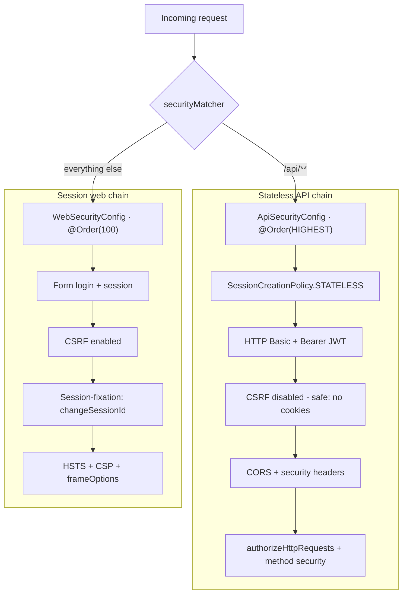
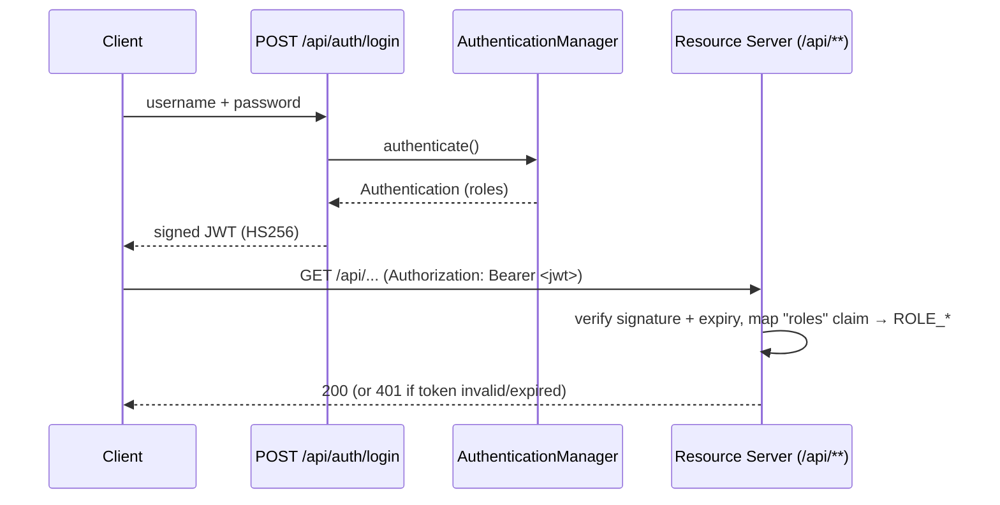
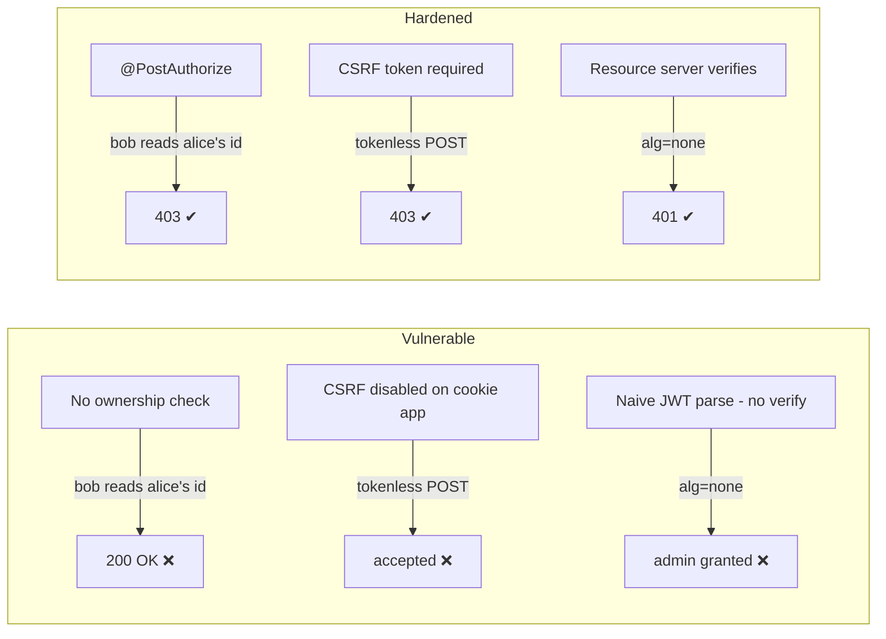

# 🔐 Spring Security Lab — Best Practices & Attack/Defense Demos


A hands-on study repository for **Spring Security 6.x**. Every concept is shown two ways: the
**idiomatic, hardened implementation** you should ship, and a **deliberately vulnerable counterpart**
that demonstrates a well-known web attack. Both are proven with **automated JUnit + MockMvc tests**, so
you can read the attack, run the test, and watch the defense hold.

> ⚠️ **Educational use only.** All "attacks" run **in-process** against MockMvc — no sockets are opened,
> no external system is ever touched, JWTs are minted locally with throwaway keys, and every vulnerable
> class lives under `src/test`, so it never reaches the production classpath. Use this to *learn defense*.

---

## 📚 Table of contents

- [What you'll learn](#-what-youll-learn)
- [Tech stack](#-tech-stack)
- [Architecture](#-architecture)
- [Security best practices](#-security-best-practices)
- [Attack & defense catalog](#-attack--defense-catalog)
- [Getting started](#-getting-started)
- [Try it with curl](#-try-it-with-curl)
- [Test suite](#-test-suite)
- [Study resources](#-study-resources)

---

## 🎯 What you'll learn

| Area | Topics |
|------|--------|
| **Authentication** | BCrypt / `DelegatingPasswordEncoder`, JPA-backed `UserDetailsService`, HTTP Basic, form login, **stateless JWT** (OAuth2 Resource Server) |
| **Authorization** | URL rules (`authorizeHttpRequests`), **method security** (`@PreAuthorize`/`@PostAuthorize`), role vs authority |
| **Hardening** | CSRF, CORS, session management, session-fixation protection, security headers (HSTS, CSP, `nosniff`) |
| **Injection & parsing** | SQL injection (bind parameters), XXE (`disallow-doctype-decl`), mass assignment (DTO binding) |
| **Attacks & defenses** | 26 families, each with a working exploit, the fix that stops it, and a live shell-script demo: IDOR, CSRF, session fixation, brute force, weak password storage, JWT forgery, XSS, SQL injection, mass assignment, path traversal, open redirect, data exposure, CORS, user enumeration, XXE, SSRF, command injection, SpEL/SSTI, insecure deserialization, ReDoS, file upload, host header injection, log injection, insecure randomness, XPath injection, rate limiting |

---

## 🧰 Tech stack

- **Java 17**, **Spring Boot 3.5.5** (manages **Spring Security 6.5**)
- **Spring Data JPA** + **H2** (in-memory user & account store)
- **OAuth2 Resource Server** (`spring-security-oauth2-jose` / Nimbus) for JWT
- **JUnit 5**, **`spring-security-test`**, **MockMvc**, **Mockito**
- **Maven** (wrapper included), **Lombok**

Everything uses the **Spring Security 6.x lambda DSL** — no `WebSecurityConfigurerAdapter`, no `.and()`
chaining, no `authorizeRequests()/antMatchers()` — the future-proof style ([removed / deprecated APIs](https://docs.spring.io/spring-security/reference/6.5/migration-7/configuration.html)).

---

## 🏗️ Architecture

### Two filter chains, one application

The app splits its surface into a **stateless JWT/Basic API** and a **session-based web** area, each with
its own `SecurityFilterChain` selected by a `securityMatcher`.



### JWT authentication flow



### Project structure

```
src/main/java/com/arthur/security
├── VulnerableExample.java  # marker annotation; SecurityApplication excludes it from scanning
├── config/        # AppConfig (PasswordEncoder, Clock), JwtConfig, MethodSecurityConfig,
│                  # ApiSecurityConfig, WebSecurityConfig, DataSeeder
├── user/          # AppUser (JPA, @JsonIgnore password), AppUserRepository,
│                  # JpaUserDetailsService, UserProfile DTO, UserController (/api/users/me)
├── auth/          # AuthController (JWT login), TokenService,
│                  # RegistrationController (record binding -> mass-assignment fix)
├── account/       # Account (JPA), AccountService (@PostAuthorize ownership -> IDOR fix,
│                  # derived query -> SQL-injection fix)
├── login/         # LoginAttemptService + AuthenticationEventListener (brute-force lockout)
├── files/         # FileStorageService (normalise + containment -> path-traversal fix)
├── xml/           # SafeXmlParser (DOCTYPE disallowed -> XXE fix)
├── net/           # UrlFetchService (scheme + host allowlist + resolved-address -> SSRF fix)
└── web/           # MainController (role-gated endpoints + HTML-escaped echo),
                   # SafeRedirectController (allowlisted target -> open-redirect fix)

src/test/java/com/arthur/security/attacks
├── report/            # SecurityReport + listener: the terminal output and summary table
├── VulnerableCodeIsolationTest.java   # proves no /vulnerable/** route reaches the real app
├── accesscontrol/     # IDOR + vertical escalation
├── csrf/              # CSRF token enforcement
├── sessionfixation/   # session id rotation at login
├── bruteforce/        # lockout, password storage, unlimited-guess demo
├── jwt/               # alg=none, wrong key, expired, weak-secret dictionary
├── headers/           # security headers + reflected XSS
├── sqli/              # tautology + comment payloads vs. bind parameters
├── massassignment/    # over-posting "roles":"ADMIN" vs. record binding
├── pathtraversal/     # ../ escape vs. normalise + containment
├── openredirect/      # attacker URL in Location vs. allowlist
├── dataexposure/      # entity serialisation leaking the hash vs. DTO + @JsonIgnore
├── cors/              # reflected origin + credentials vs. explicit allowlist
├── enumeration/       # distinguishable login failures vs. uniform response
├── xxe/               # external entity file read vs. disallow-doctype-decl
└── ssrf/              # loopback / file:// fetch vs. allowlist + address check
```

---

## 🛡️ Security best practices

### 1. Never store plaintext passwords

```java
@Bean
PasswordEncoder passwordEncoder() {
    return PasswordEncoderFactories.createDelegatingPasswordEncoder(); // encodes as {bcrypt}
}
```

The `DelegatingPasswordEncoder` stores hashes with an id prefix (`{bcrypt}$2a$10$...`). A plaintext value
with no prefix throws `IllegalArgumentException: There is no PasswordEncoder mapped for the id "null"` —
the classic Spring Security 6 beginner error the original code in this repo had.

### 2. Deny by default, layer object-level checks

```java
http.authorizeHttpRequests(auth -> auth
    .requestMatchers("/api/v1/welcome").permitAll()
    .requestMatchers("/api/v1/user").hasRole("USER")
    .requestMatchers("/api/v1/admin", "/api/admin/**").hasRole("ADMIN")
    .anyRequest().authenticated());
```

URL rules stop *vertical* escalation. **Object-level** access (the real IDOR fix) needs method security:

```java
@PostAuthorize("returnObject.owner == authentication.name or hasRole('ADMIN')")
public Account getAccount(Long id) { ... }
```

### 3. CSRF: on for cookies, off for bearer tokens

CSRF protection is **enabled by default** and required for the cookie/session web chain. It is disabled
**only** on the stateless API — a browser never auto-attaches the `Authorization` header, so there is
nothing to forge. Disabling CSRF on a cookie-authenticated app is the single most copy-pasted mistake in
tutorials.

### 4. Keep the secure-by-default headers

```java
http.headers(h -> h
    .contentSecurityPolicy(csp -> csp.policyDirectives("default-src 'none'; frame-ancestors 'none'"))
    .httpStrictTransportSecurity(hsts -> hsts.includeSubDomains(true).maxAgeInSeconds(31536000)));
```

`X-Content-Type-Options: nosniff`, `X-Frame-Options: DENY` and `Cache-Control: no-store` are on by
default; CSP is not — add it. (Real header output is [below](#-try-it-with-curl).)

### 5. Encode output to defeat XSS

```java
return "You said: " + HtmlUtils.htmlEscape(message); // <script> → &lt;script&gt;
```

---

## ⚔️ Attack & defense catalog

Each family has a `...VulnerabilityTest` (proves the flaw) and a `...DefenseTest` (proves the fix).

| # | Attack | OWASP / CWE | Spring defense | Tests |
|---|--------|-------------|----------------|-------|
| 1 | **Broken Access Control / IDOR** | A01:2021 · CWE-639 | `@PostAuthorize` ownership + role-gated URLs | `accesscontrol/*` |
| 2 | **CSRF** | A01:2021 · CWE-352 | Synchronizer token (default), disabled only for bearer API | `csrf/*` |
| 3 | **Session Fixation** | A07:2021 · CWE-384 | `sessionFixation().changeSessionId()` (default) | `sessionfixation/*` |
| 4 | **Brute Force / Credential Stuffing** | A07:2021 · CWE-307 | Event-driven lockout via `LoginAttemptService` | `bruteforce/BruteForce*`, `LoginAttemptServiceTest` |
| 5 | **Weak Password Storage** | A02:2021 · CWE-256/916 | BCrypt via `DelegatingPasswordEncoder` (salted, adaptive) | `bruteforce/PasswordStorageTest` |
| 6 | **JWT forgery** (`alg=none`, wrong key, expired, weak secret) | A02/A07 · CWE-345/347 | OAuth2 Resource Server + `NimbusJwtDecoder` (verifies signature + expiry) | `jwt/*` |
| 7 | **XSS + missing headers** | A03:2021 · CWE-79 | `HtmlUtils.htmlEscape` + CSP / `nosniff` | `headers/*` |
| 8 | **SQL Injection** | A03:2021 · CWE-89 | Bind parameters (Spring Data derived query / `PreparedStatement`) | `sqli/*` |
| 9 | **Mass Assignment** | A08:2021 · CWE-915 | Bind to a narrow DTO record; server assigns the role | `massassignment/*` |
| 10 | **Path Traversal** | A01:2021 · CWE-22 | `normalize()` + `startsWith(base)` containment check | `pathtraversal/*` |
| 11 | **Open Redirect** | CWE-601 | Relative-only, or host allowlist on a parsed `URI` | `openredirect/*` |
| 12 | **Sensitive Data Exposure** | A02:2021 · CWE-200 | `UserProfile` DTO + `@JsonIgnore` on the hash | `dataexposure/*` |
| 13 | **CORS misconfiguration** | A05:2021 · CWE-942 | Explicit origin allowlist, never a reflected origin | `cors/*` |
| 14 | **Username Enumeration** | A07:2021 · CWE-204 | Identical status + body for both failure modes | `enumeration/*` |
| 15 | **XXE** | A05:2021 · CWE-611 | `disallow-doctype-decl` + external entities off | `xxe/*` |
| 16 | **SSRF** | A10:2021 · CWE-918 | Scheme + host allowlist, resolved-address check, no redirects | `ssrf/*` |
| 17 | **OS Command Injection** | A03:2021 · CWE-78 | Host allowlist; never build a shell string from input | `commandinjection/*` |
| 18 | **SpEL / Template Injection (SSTI)** | A03:2021 · CWE-917 | Never evaluate user input as an expression | `spel/*` |
| 19 | **Insecure Deserialization** | A08:2021 · CWE-502 | Parse JSON into a fixed type; no native `readObject` | `deserialization/*` |
| 20 | **ReDoS** | CWE-1333 | Length cap + linear check (no catastrophic backtracking) | `redos/*` |
| 21 | **Unrestricted File Upload** | A05:2021 · CWE-434 | Extension allowlist + server-generated name + size cap | `fileupload/*` |
| 22 | **Host Header Injection** | CWE-644 | Build links from a configured base URL, not `Host` | `hostheader/*` |
| 23 | **Log Injection (CRLF)** | A09:2021 · CWE-117 | Strip CR/LF/controls before logging | `loginjection/*` |
| 24 | **Insecure Randomness** | A02:2021 · CWE-330 | `SecureRandom` + 256-bit tokens, never `java.util.Random` | `randomness/*` |
| 25 | **XPath Injection** | A03:2021 · CWE-643 | Bound XPath variables (`XPathVariableResolver`) | `xpath/*` |
| 26 | **Missing Rate Limiting** | A04:2021 · CWE-770 | Per-client throttling → HTTP 429 | `ratelimit/*` |

### How each demo works



Deep dives: **[guides/attacks.md](guides/attacks.md)** · **[guides/best-practices.md](guides/best-practices.md)**

### ▶️ Run the attacks yourself (dissected in depth, with real cases)

Each attack is a **self-contained folder** under `scripts/attacks/<nn-name>/` with four artifacts: a
multi-variant, runnable `.java` (the **vulnerable** and **safe** code side by side, several real
techniques each), a `DEEP-DIVE.md` (layperson→advanced, with **real incidents/CVEs — classic and
2025–2026 — linked**, and reimplemented snippets credited to WebGoat / java-sec-code /
PayloadsAllTheThings / ysoserial), a `payloads.txt` cheatsheet, and the `.sh` that explains it in 3
levels, **shows the code**, and **runs it**. No server required.

```bash
scripts/attacks/08-sql-injection/08-sql-injection.sh          # explains + shows + runs (5 SQLi techniques)
less scripts/attacks/16-ssrf/DEEP-DIVE.md                      # Capital One, IMDS, DNS rebinding, CVE-2026-…
scripts/run-all.sh                                            # all 26 in sequence
java scripts/attacks/06-jwt/JwtDemo.java                       # just the code (alg=none, weak secret, alg confusion)
```

Real patterns are **reimplemented and cited**, never weaponized (no third-party RCE / live gadget
chains). Most demos are pure JDK; a few use the project's libs via `scripts/lib/classpath.txt`. See
**[scripts/README.md](scripts/README.md)**.

---

## 🚀 Getting started

**Prerequisites:** JDK 17+ (built and verified on JDK 21). No Maven install needed — use the wrapper.

```bash
# Run all attack/defense + best-practice tests
./mvnw test

# Run the application (http://localhost:8080)
./mvnw spring-boot:run
```

Seeded users (passwords are BCrypt-hashed in the H2 table, never plaintext):

| Username | Password | Roles |
|----------|----------|-------|
| `arthur` | `password` | `USER` |
| `admin`  | `password` | `ADMIN`, `USER` |

The H2 console (dev only) is at `http://localhost:8080/h2-console` (JDBC URL `jdbc:h2:mem:securitydb`,
user `sa`) — a good way to *see* the `{bcrypt}` hashes.

---

## 🧪 Try it with curl

Real output captured from a running instance:

```console
$ curl -o /dev/null -w "%{http_code}" http://localhost:8080/api/v1/welcome
200                                            # public

$ curl -o /dev/null -w "%{http_code}" http://localhost:8080/api/v1/user
401                                            # protected, no credentials

$ curl -u arthur:password  .../api/v1/user  -> 200   # USER role ✔
$ curl -u arthur:password  .../api/v1/admin -> 403   # USER cannot reach ADMIN ✔
$ curl -u admin:password   .../api/v1/admin -> 200   # ADMIN role ✔
```

**JWT login → call the API:**

```console
$ TOKEN=$(curl -s -X POST .../api/auth/login \
    -H 'Content-Type: application/json' \
    -d '{"username":"arthur","password":"password"}' | jq -r .token)

$ curl -H "Authorization: Bearer $TOKEN" .../api/v1/user       -> 200 ✔
```

**IDOR blocked (arthur owns account 1, not 2):**

```console
$ curl -H "Authorization: Bearer $TOKEN" .../api/accounts/1 -> 200   # own account ✔
$ curl -H "Authorization: Bearer $TOKEN" .../api/accounts/2 -> 403   # someone else's ✔
```

**Security headers & XSS output-encoding:**

```console
$ curl -D - .../api/v1/welcome
X-Content-Type-Options: nosniff
X-Frame-Options: DENY
Content-Security-Policy: default-src 'none'; frame-ancestors 'none'
Cache-Control: no-cache, no-store, max-age=0, must-revalidate

$ curl -u arthur:password ".../api/v1/echo?message=%3Cscript%3Ealert(1)%3C%2Fscript%3E"
You said: &lt;script&gt;alert(1)&lt;/script&gt;   # payload neutralised ✔
```

**Sensitive data & mass assignment** — the hash never leaves the server, and an injected role is dropped:

```console
$ curl -H "Authorization: Bearer $TOKEN" .../api/users/me
{"username":"arthur","roles":["USER"]}          # no password, no internal id ✔

$ curl -X POST .../api/auth/register -H 'Content-Type: application/json' \
    -d '{"username":"mallory","password":"hunter2-long","roles":"ADMIN"}'
{"username":"mallory","roles":["USER"]}         # injected "roles":"ADMIN" ignored ✔
```

**Injection, traversal, redirect & SSRF** — each payload is refused by the real endpoint:

```console
$ curl -H "Authorization: Bearer $ADMIN_TOKEN" ".../api/accounts/search?owner=arthur'%20OR%20'1'='1"
[]                                                      # parameterized, nothing leaks ✔

$ curl -H "Authorization: Bearer $TOKEN" ".../api/files?name=readme.txt"       -> 200 ✔
$ curl -H "Authorization: Bearer $TOKEN" ".../api/files?name=../../etc/passwd" -> 400 ✔

$ curl ".../api/redirect?to=/dashboard"                 -> 302 ✔
$ curl ".../api/redirect?to=https://evil.example/login" -> 400 ✔

$ curl -H 'Content-Type: application/xml' -d '<note>hello</note>' .../api/xml/parse   -> 200 ✔
$ curl -H 'Content-Type: application/xml' \
    -d '<!DOCTYPE n [<!ENTITY x SYSTEM "file:///etc/passwd">]><note>&x;</note>' \
    .../api/xml/parse                                                                 -> 400 ✔

$ curl -H "Authorization: Bearer $ADMIN_TOKEN" ".../api/fetch?url=http://127.0.0.1:9999/" -> 400 ✔
$ curl -H "Authorization: Bearer $ADMIN_TOKEN" ".../api/fetch?url=file:///etc/passwd"     -> 400 ✔
```

---

## ✅ Test suite

`./mvnw test` — **100 tests, all passing** across 26 attack/defense families.

Every demo reports itself as it runs, so the terminal shows the attack and its outcome rather than
Spring's start-up chatter (quieted by `src/test/resources/logback-test.xml`):

```console
  XX  VULNERAVEL SQL Injection        alice' OR '1'='1           -> 3 contas vazadas (esperado: 1)
  OK  DEFENDIDO  SQL Injection        alice' OR '1'='1           -> 0 resultados - valor tratado como dado
  XX  VULNERAVEL Path Traversal       GET ?name=../secrets...    -> leu arquivo fora do diretorio publico
  OK  DEFENDIDO  Path Traversal       GET ?name=../secrets...    -> 400 - caminho normalizado sai da base
  XX  VULNERAVEL SSRF                 GET http://127.0.0.1:...   -> credencial interna exfiltrada
  OK  DEFENDIDO  SSRF                 GET http://127.0.0.1:...   -> 400 - host fora da allowlist
```

and the run ends with a grouped summary:

```console
  RELATORIO DE SEGURANCA  -  ataques demonstrados vs. defesas
========================================================================
  CATEGORIA                            VULNERAVEL      DEFENDIDO
  --------------------------------------------------------------------
  Access Control                                1              4
  Brute Force                                   1              4
  Armazenamento de Senha                        1              1
  CSRF                                          1              4
  Headers / XSS                                 1              2
  JWT                                           2              4
  Session Fixation                              1              2
  SQL Injection                                 2              4
  Mass Assignment                               1              2
  Open Redirect                                 2              3
  Path Traversal                                1              4
  CORS                                          1              3
  Exposicao de Dados                            1              3
  Enumeracao de Usuarios                        1              2
  SSRF                                          2              4
  XXE                                           2              3
  Command Injection                             1              3
  Desserializacao Insegura                      1              2
  Upload sem Restricao                          1              2
  Host Header Injection                         1              1
  Log Injection (CRLF)                          1              1
  Aleatoriedade Insegura                        1              1
  Rate Limiting Ausente                         1              1
  ReDoS                                         1              2
  SpEL / SSTI                                   1              2
  XPath Injection                               1              2
  Isolamento do Codigo Inseguro                 0              2
  --------------------------------------------------------------------
  TOTAL (27 categorias)                        31             68
========================================================================
  VULNERAVEL = ataque comprovadamente bem-sucedido contra o codigo inseguro de
               exemplo, isolado em src/test, fora do classpath de producao.
  DEFENDIDO  = o mesmo ataque barrado pela aplicacao real.
```

`XX VULNERAVEL` lines are not failures — they are assertions that the insecure example really is
exploitable. A green build means every attack landed on the vulnerable code **and** was blocked by the
real application. Set `NO_COLOR=1` to drop the ANSI colouring.

The report is produced by `attacks/report/SecurityReport.java`; the table is printed by
`SecurityReportListener`, registered through `META-INF/services/org.junit.platform.launcher.TestExecutionListener`.

### Keeping the insecure examples out of the application

Every `Vulnerable*` class must be annotated `@Controller` for `MockMvcBuilders.standaloneSetup(...)` to
register its handler methods — which also makes it a component-scan candidate, since it lives under the
scanned `com.arthur.security` package and `src/test` is on the classpath while tests run. Left alone,
those insecure endpoints join the very application the defense tests are supposed to probe.

They are therefore annotated `@VulnerableExample`, which `SecurityApplication` excludes from component
scanning, and `VulnerableCodeIsolationTest` fails the build if a `/vulnerable/**` route or a
`@VulnerableExample` bean ever appears in the context. (They never ship either way: `src/test` is not
part of the packaged jar.)

Representative test names read like a checklist of what's proven:

- `IDOR blocked — a user cannot read another user's account`
- `a tautology payload dumps every row in the table` / `bind parameters make the tautology payload match nothing`
- `an extra roles field in the body grants the attacker ADMIN` / `the injected roles field is ignored`
- `../ escapes the public directory and reads a secret file` / `nested and absolute traversal variants are rejected too`
- `the response tells the attacker which usernames exist` / `unknown user and wrong password give byte-identical responses`
- `an external entity reads a local file into the parsed document` / `the DOCTYPE is refused`
- `the server reaches an internal service the attacker cannot route to` / `an allowlisted host that resolves to loopback is still refused`
- `an alg=none forged token is rejected` · `a weak HMAC secret is recovered by an offline dictionary attack`

---

## 📖 Study resources

**Spring Security reference**
- [Password Storage](https://docs.spring.io/spring-security/reference/features/authentication/password-storage.html) ·
  [Authorize HTTP Requests](https://docs.spring.io/spring-security/reference/servlet/authorization/authorize-http-requests.html) ·
  [Method Security](https://docs.spring.io/spring-security/reference/servlet/authorization/method-security.html)
- [CSRF](https://docs.spring.io/spring-security/reference/servlet/exploits/csrf.html) ·
  [CORS](https://docs.spring.io/spring-security/reference/servlet/integrations/cors.html) ·
  [Session Management](https://docs.spring.io/spring-security/reference/servlet/authentication/session-management.html) ·
  [Security Headers](https://docs.spring.io/spring-security/reference/servlet/exploits/headers.html)
- [OAuth2 Resource Server (JWT)](https://docs.spring.io/spring-security/reference/servlet/oauth2/resource-server/jwt.html) ·
  [Testing with MockMvc](https://docs.spring.io/spring-security/reference/servlet/test/mockmvc/index.html)

**OWASP**
- [Top 10:2021](https://owasp.org/Top10/) ·
  [IDOR Prevention](https://cheatsheetseries.owasp.org/cheatsheets/Insecure_Direct_Object_Reference_Prevention_Cheat_Sheet.html) ·
  [CSRF Prevention](https://cheatsheetseries.owasp.org/cheatsheets/Cross-Site_Request_Forgery_Prevention_Cheat_Sheet.html) ·
  [Password Storage](https://cheatsheetseries.owasp.org/cheatsheets/Password_Storage_Cheat_Sheet.html) ·
  [XSS Prevention](https://cheatsheetseries.owasp.org/cheatsheets/Cross_Site_Scripting_Prevention_Cheat_Sheet.html)

**PortSwigger Web Security Academy**
- [Access control / IDOR](https://portswigger.net/web-security/access-control/idor) ·
  [CSRF](https://portswigger.net/web-security/csrf) ·
  [JWT attacks](https://portswigger.net/web-security/jwt) ·
  [XSS](https://portswigger.net/web-security/cross-site-scripting)

---

*Built as a learning resource for defensive security and Spring Security 6.x. The vulnerable code exists
solely to teach — keep it in `src/test`, and never ship it.*
