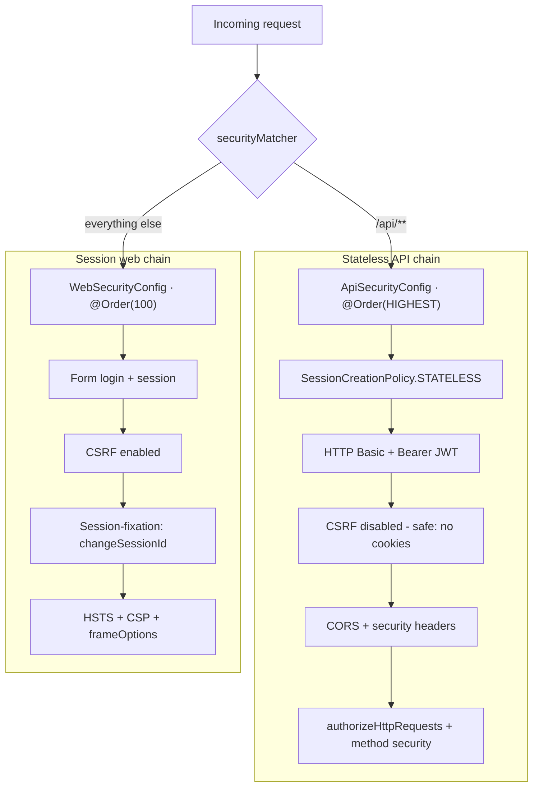
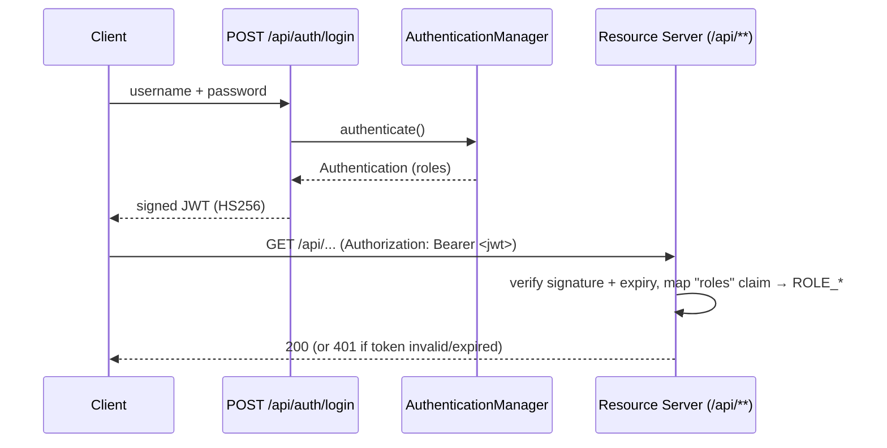
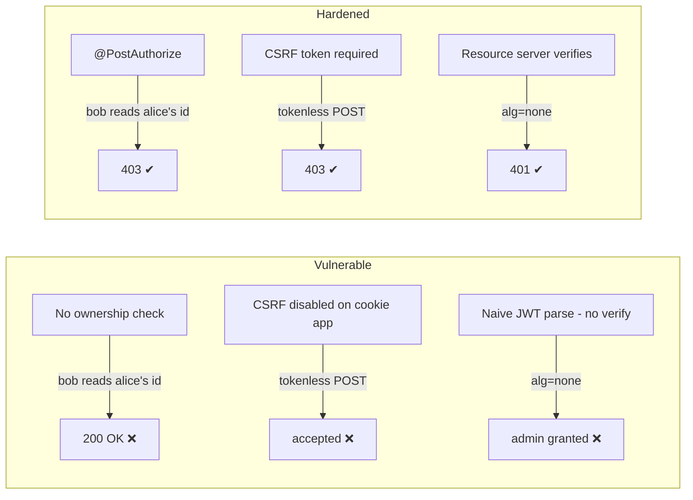

# 🔐 Spring Security Lab — Best Practices & Attack/Defense Demos


A hands-on study repository for **Spring Security 6.x**. Every concept is shown two ways: the
**idiomatic, hardened implementation** you should ship, and a **deliberately vulnerable counterpart**
that demonstrates a well-known web attack. Both are proven with **automated JUnit + MockMvc tests**, so
you can read the attack, run the test, and watch the defense hold.

> ⚠️ **Educational use only.** All "attacks" run **in-process** against MockMvc — no sockets are opened,
> no external system is ever touched, JWTs are minted locally with throwaway keys, and every vulnerable
> class lives under `src/test`, so it never reaches the production classpath. Use this to *learn defense*.

---

## 📚 Table of contents

- [What you'll learn](#-what-youll-learn)
- [Tech stack](#-tech-stack)
- [Architecture](#-architecture)
- [Security best practices](#-security-best-practices)
- [Attack & defense catalog](#-attack--defense-catalog)
- [Getting started](#-getting-started)
- [Try it with curl](#-try-it-with-curl)
- [Test suite](#-test-suite)
- [Study resources](#-study-resources)

---

## 🎯 What you'll learn

| Area | Topics |
|------|--------|
| **Authentication** | BCrypt / `DelegatingPasswordEncoder`, JPA-backed `UserDetailsService`, HTTP Basic, form login, **stateless JWT** (OAuth2 Resource Server) |
| **Authorization** | URL rules (`authorizeHttpRequests`), **method security** (`@PreAuthorize`/`@PostAuthorize`), role vs authority |
| **Hardening** | CSRF, CORS, session management, session-fixation protection, security headers (HSTS, CSP, `nosniff`) |
| **Attacks & defenses** | Broken Access Control / IDOR, CSRF, Session Fixation, Brute Force, weak password storage, JWT forgery, XSS |

---

## 🧰 Tech stack

- **Java 17**, **Spring Boot 3.5.5** (manages **Spring Security 6.5**)
- **Spring Data JPA** + **H2** (in-memory user & account store)
- **OAuth2 Resource Server** (`spring-security-oauth2-jose` / Nimbus) for JWT
- **JUnit 5**, **`spring-security-test`**, **MockMvc**, **Mockito**
- **Maven** (wrapper included), **Lombok**

Everything uses the **Spring Security 6.x lambda DSL** — no `WebSecurityConfigurerAdapter`, no `.and()`
chaining, no `authorizeRequests()/antMatchers()` — the future-proof style ([removed / deprecated APIs](https://docs.spring.io/spring-security/reference/6.5/migration-7/configuration.html)).

---

## 🏗️ Architecture

### Two filter chains, one application

The app splits its surface into a **stateless JWT/Basic API** and a **session-based web** area, each with
its own `SecurityFilterChain` selected by a `securityMatcher`.



### JWT authentication flow



### Project structure

```
src/main/java/com/arthur/security
├── config/        # AppConfig (PasswordEncoder, Clock), JwtConfig, MethodSecurityConfig,
│                  # ApiSecurityConfig, WebSecurityConfig, DataSeeder
├── user/          # AppUser (JPA), AppUserRepository, JpaUserDetailsService
├── auth/          # AuthController (JWT login), TokenService
├── account/       # Account (JPA), AccountService (@PostAuthorize ownership → IDOR fix)
├── login/         # LoginAttemptService + AuthenticationEventListener (brute-force lockout)
└── web/           # MainController (role-gated endpoints + safe HTML-escaped echo)

src/test/java/com/arthur/security/attacks
├── accesscontrol/ # IDOR + vertical escalation
├── csrf/          # CSRF token enforcement
├── sessionfixation/
├── bruteforce/    # lockout, password storage, unlimited-guess demo
├── jwt/           # alg=none, wrong key, expired, weak-secret dictionary
└── headers/       # security headers + reflected XSS
```

---

## 🛡️ Security best practices

### 1. Never store plaintext passwords

```java
@Bean
PasswordEncoder passwordEncoder() {
    return PasswordEncoderFactories.createDelegatingPasswordEncoder(); // encodes as {bcrypt}
}
```

The `DelegatingPasswordEncoder` stores hashes with an id prefix (`{bcrypt}$2a$10$...`). A plaintext value
with no prefix throws `IllegalArgumentException: There is no PasswordEncoder mapped for the id "null"` —
the classic Spring Security 6 beginner error the original code in this repo had.

### 2. Deny by default, layer object-level checks

```java
http.authorizeHttpRequests(auth -> auth
    .requestMatchers("/api/v1/welcome").permitAll()
    .requestMatchers("/api/v1/user").hasRole("USER")
    .requestMatchers("/api/v1/admin", "/api/admin/**").hasRole("ADMIN")
    .anyRequest().authenticated());
```

URL rules stop *vertical* escalation. **Object-level** access (the real IDOR fix) needs method security:

```java
@PostAuthorize("returnObject.owner == authentication.name or hasRole('ADMIN')")
public Account getAccount(Long id) { ... }
```

### 3. CSRF: on for cookies, off for bearer tokens

CSRF protection is **enabled by default** and required for the cookie/session web chain. It is disabled
**only** on the stateless API — a browser never auto-attaches the `Authorization` header, so there is
nothing to forge. Disabling CSRF on a cookie-authenticated app is the single most copy-pasted mistake in
tutorials.

### 4. Keep the secure-by-default headers

```java
http.headers(h -> h
    .contentSecurityPolicy(csp -> csp.policyDirectives("default-src 'none'; frame-ancestors 'none'"))
    .httpStrictTransportSecurity(hsts -> hsts.includeSubDomains(true).maxAgeInSeconds(31536000)));
```

`X-Content-Type-Options: nosniff`, `X-Frame-Options: DENY` and `Cache-Control: no-store` are on by
default; CSP is not — add it. (Real header output is [below](#-try-it-with-curl).)

### 5. Encode output to defeat XSS

```java
return "You said: " + HtmlUtils.htmlEscape(message); // <script> → &lt;script&gt;
```

---

## ⚔️ Attack & defense catalog

Each family has a `...VulnerabilityTest` (proves the flaw) and a `...DefenseTest` (proves the fix).

| # | Attack | OWASP / CWE | Spring defense | Tests |
|---|--------|-------------|----------------|-------|
| 1 | **Broken Access Control / IDOR** | A01:2021 · CWE-639 | `@PostAuthorize` ownership + role-gated URLs | `accesscontrol/*` |
| 2 | **CSRF** | A01:2021 · CWE-352 | Synchronizer token (default), disabled only for bearer API | `csrf/*` |
| 3 | **Session Fixation** | A07:2021 · CWE-384 | `sessionFixation().changeSessionId()` (default) | `sessionfixation/*` |
| 4 | **Brute Force / Credential Stuffing** | A07:2021 · CWE-307 | Event-driven lockout via `LoginAttemptService` | `bruteforce/BruteForce*`, `LoginAttemptServiceTest` |
| 5 | **Weak Password Storage** | A02:2021 · CWE-256/916 | BCrypt via `DelegatingPasswordEncoder` (salted, adaptive) | `bruteforce/PasswordStorageTest` |
| 6 | **JWT forgery** (`alg=none`, wrong key, expired, weak secret) | A02/A07 · CWE-345/347 | OAuth2 Resource Server + `NimbusJwtDecoder` (verifies signature + expiry) | `jwt/*` |
| 7 | **XSS + missing headers** | A03:2021 · CWE-79 | `HtmlUtils.htmlEscape` + CSP / `nosniff` | `headers/*` |

### How each demo works



Deep dives: **[guides/attacks.md](guides/attacks.md)** · **[guides/best-practices.md](guides/best-practices.md)**

---

## 🚀 Getting started

**Prerequisites:** JDK 17+ (built and verified on JDK 21). No Maven install needed — use the wrapper.

```bash
# Run all attack/defense + best-practice tests
./mvnw test

# Run the application (http://localhost:8080)
./mvnw spring-boot:run
```

Seeded users (passwords are BCrypt-hashed in the H2 table, never plaintext):

| Username | Password | Roles |
|----------|----------|-------|
| `arthur` | `password` | `USER` |
| `admin`  | `password` | `ADMIN`, `USER` |

The H2 console (dev only) is at `http://localhost:8080/h2-console` (JDBC URL `jdbc:h2:mem:securitydb`,
user `sa`) — a good way to *see* the `{bcrypt}` hashes.

---

## 🧪 Try it with curl

Real output captured from a running instance:

```console
$ curl -o /dev/null -w "%{http_code}" http://localhost:8080/api/v1/welcome
200                                            # public

$ curl -o /dev/null -w "%{http_code}" http://localhost:8080/api/v1/user
401                                            # protected, no credentials

$ curl -u arthur:password  .../api/v1/user  -> 200   # USER role ✔
$ curl -u arthur:password  .../api/v1/admin -> 403   # USER cannot reach ADMIN ✔
$ curl -u admin:password   .../api/v1/admin -> 200   # ADMIN role ✔
```

**JWT login → call the API:**

```console
$ TOKEN=$(curl -s -X POST .../api/auth/login \
    -H 'Content-Type: application/json' \
    -d '{"username":"arthur","password":"password"}' | jq -r .token)

$ curl -H "Authorization: Bearer $TOKEN" .../api/v1/user       -> 200 ✔
```

**IDOR blocked (arthur owns account 1, not 2):**

```console
$ curl -H "Authorization: Bearer $TOKEN" .../api/accounts/1 -> 200   # own account ✔
$ curl -H "Authorization: Bearer $TOKEN" .../api/accounts/2 -> 403   # someone else's ✔
```

**Security headers & XSS output-encoding:**

```console
$ curl -D - .../api/v1/welcome
X-Content-Type-Options: nosniff
X-Frame-Options: DENY
Content-Security-Policy: default-src 'none'; frame-ancestors 'none'
Cache-Control: no-cache, no-store, max-age=0, must-revalidate

$ curl -u arthur:password ".../api/v1/echo?message=%3Cscript%3Ealert(1)%3C%2Fscript%3E"
You said: &lt;script&gt;alert(1)&lt;/script&gt;   # payload neutralised ✔
```

---

## ✅ Test suite

`./mvnw test` — **30 tests, all passing**:

```console
Running ...attacks.accesscontrol.AccessControlDefenseTest        Tests run: 4  ✔
Running ...attacks.accesscontrol.AccessControlVulnerabilityTest  Tests run: 1  ✔
Running ...attacks.bruteforce.BruteForceDefenseTest             Tests run: 1  ✔
Running ...attacks.bruteforce.BruteForceVulnerabilityTest       Tests run: 1  ✔
Running ...attacks.bruteforce.LoginAttemptServiceTest           Tests run: 3  ✔
Running ...attacks.bruteforce.PasswordStorageTest              Tests run: 2  ✔
Running ...attacks.csrf.CsrfDefenseTest                        Tests run: 4  ✔
Running ...attacks.csrf.CsrfVulnerabilityTest                  Tests run: 1  ✔
Running ...attacks.headers.HeadersXssDefenseTest              Tests run: 2  ✔
Running ...attacks.headers.HeadersXssVulnerabilityTest        Tests run: 1  ✔
Running ...attacks.jwt.JwtDefenseTest                         Tests run: 4  ✔
Running ...attacks.jwt.JwtVulnerabilityTest                   Tests run: 2  ✔
Running ...attacks.sessionfixation.SessionFixationDefenseTest       Tests run: 1  ✔
Running ...attacks.sessionfixation.SessionFixationVulnerabilityTest Tests run: 2  ✔
Running ...SecurityApplicationTests                           Tests run: 1  ✔

Tests run: 30, Failures: 0, Errors: 0, Skipped: 0
BUILD SUCCESS
```

Representative test names read like a checklist of what's proven:

- `IDOR blocked — a user cannot read another user's account`
- `session-based POST without a CSRF token is rejected` / `stateless API is correctly exempt from CSRF`
- `changeSessionId rotates the session id at login`
- `account locks after repeated failures — the correct password then fails too`
- `an alg=none forged token is rejected` · `a token signed with the wrong key is rejected` · `an expired token is rejected`
- `a weak HMAC secret is recovered by an offline dictionary attack`

---

## 📖 Study resources

**Spring Security reference**
- [Password Storage](https://docs.spring.io/spring-security/reference/features/authentication/password-storage.html) ·
  [Authorize HTTP Requests](https://docs.spring.io/spring-security/reference/servlet/authorization/authorize-http-requests.html) ·
  [Method Security](https://docs.spring.io/spring-security/reference/servlet/authorization/method-security.html)
- [CSRF](https://docs.spring.io/spring-security/reference/servlet/exploits/csrf.html) ·
  [CORS](https://docs.spring.io/spring-security/reference/servlet/integrations/cors.html) ·
  [Session Management](https://docs.spring.io/spring-security/reference/servlet/authentication/session-management.html) ·
  [Security Headers](https://docs.spring.io/spring-security/reference/servlet/exploits/headers.html)
- [OAuth2 Resource Server (JWT)](https://docs.spring.io/spring-security/reference/servlet/oauth2/resource-server/jwt.html) ·
  [Testing with MockMvc](https://docs.spring.io/spring-security/reference/servlet/test/mockmvc/index.html)

**OWASP**
- [Top 10:2021](https://owasp.org/Top10/) ·
  [IDOR Prevention](https://cheatsheetseries.owasp.org/cheatsheets/Insecure_Direct_Object_Reference_Prevention_Cheat_Sheet.html) ·
  [CSRF Prevention](https://cheatsheetseries.owasp.org/cheatsheets/Cross-Site_Request_Forgery_Prevention_Cheat_Sheet.html) ·
  [Password Storage](https://cheatsheetseries.owasp.org/cheatsheets/Password_Storage_Cheat_Sheet.html) ·
  [XSS Prevention](https://cheatsheetseries.owasp.org/cheatsheets/Cross_Site_Scripting_Prevention_Cheat_Sheet.html)

**PortSwigger Web Security Academy**
- [Access control / IDOR](https://portswigger.net/web-security/access-control/idor) ·
  [CSRF](https://portswigger.net/web-security/csrf) ·
  [JWT attacks](https://portswigger.net/web-security/jwt) ·
  [XSS](https://portswigger.net/web-security/cross-site-scripting)

---

*Built as a learning resource for defensive security and Spring Security 6.x. The vulnerable code exists
solely to teach — keep it in `src/test`, and never ship it.*
