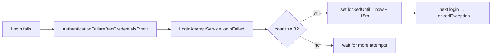

# Attack & Defense Deep Dive

Each section explains the attack, how it manifests against a Spring Boot API, the Spring defense, and the
tests that prove both the flaw and the fix. All demos are self-contained: MockMvc, an in-memory
H2 database, and - for the SSRF demo - a throwaway HTTP server bound to loopback. Nothing leaves
the machine.

← Back to the [README](../README.md)

---

## 1. Broken Access Control / IDOR — `A01:2021`, `CWE-639`

**Attack.** Access control must stop users acting outside their permissions. IDOR (Insecure Direct Object
Reference) is the classic case: the app uses a client-supplied id (`/api/accounts/{id}`) to fetch an
object but never checks the caller *owns* it — so changing `1` → `2` reads someone else's data. Vertical
escalation is the sibling case: a regular user reaching an admin-only function.

**In Spring Boot.** A controller that calls `repository.findById(id)` and returns it while the URL rule
only requires `.authenticated()`.

**Defense.**
- Deny-by-default URL rules for function-level access: `.requestMatchers("/api/admin/**").hasRole("ADMIN")`.
- **Object-level** ownership with method security — the real IDOR fix:
  ```java
  @PostAuthorize("returnObject.owner == authentication.name or hasRole('ADMIN')")
  public Account getAccount(Long id) { ... }
  ```
  Or scope the query to the principal: `repository.findByIdAndOwner(id, principal)`.

**Tests.** `AccessControlVulnerabilityTest` (bob reads alice's object → 200 on the unguarded controller);
`AccessControlDefenseTest` (owner → 200, other user → 403, admin → 200, anonymous admin path → 401).

---

## 2. CSRF — `A01:2021`, `CWE-352`

**Attack.** A malicious page makes the victim's browser send a state-changing request to a site where the
victim is logged in; cookies are attached automatically, so the server cannot tell forged from genuine.

**In Spring Boot.** Any cookie/session `POST` with `csrf(csrf -> csrf.disable())` — the most copy-pasted
misconfiguration in tutorials. Nuance: a purely stateless bearer-token API genuinely does *not* need CSRF
(the browser never auto-sends `Authorization`), so disabling it there is correct.

**Defense.** CSRF protection is **on by default** (synchronizer token, validated on unsafe methods; in
Spring Security 6 the token is XOR-randomised per request for BREACH protection). Keep it for the web
chain; disable it only for the stateless API.

**Tests.** `CsrfVulnerabilityTest` (tokenless POST accepted when protection is absent);
`CsrfDefenseTest` (tokenless → 403, valid token → processed, tampered token → 403, stateless API exempt).

---

## 3. Session Fixation — `A07:2021`, `CWE-384`

**Attack.** The attacker plants a known session id on the victim (e.g. `;jsessionid=`), the victim logs
in, and if the app keeps the pre-login id the attacker now holds an authenticated session.

**Defense.** Automatic in Spring Security. The default `changeSessionId` strategy rotates the session id
at authentication; `none` disables it (vulnerable — used only in the demo). Concurrency control
(`maximumSessions(1)`) is a useful companion.

**Tests.** `SessionFixationVulnerabilityTest` contrasts `NullAuthenticatedSessionStrategy` (id unchanged)
with `ChangeSessionIdAuthenticationStrategy` (id rotated); `SessionFixationDefenseTest` logs in through
the real app and asserts the pre-login id is replaced.

---

## 4. Brute Force / Credential Stuffing — `A07:2021`, `CWE-307`

**Attack.** Brute force guesses many passwords for one account; credential stuffing replays
username/password pairs leaked elsewhere. Both exploit logins with no throttling.

**Defense.** Spring Security ships **no built-in lockout**, so this repo builds one on its authentication
events: `AuthenticationEventListener` counts `AuthenticationFailureBadCredentialsEvent`s in
`LoginAttemptService`, and after the threshold sets the user's `lockedUntil`. `JpaUserDetailsService` then
reports the account locked, and `DaoAuthenticationProvider` rejects it *before* checking the password. A
`Clock` is injected so lockout expiry is testable without `Thread.sleep`.



**Tests.** `BruteForceVulnerabilityTest` (100 wrong guesses then the correct one still works, with no
throttle); `BruteForceDefenseTest` (3 failures lock the account so even the correct password is rejected);
`LoginAttemptServiceTest` (locks at threshold, unlocks after the window using a mutable clock).

---

## 5. Weak Password Storage — `A02:2021`, `CWE-256 / CWE-916`

**Attack.** Plaintext or fast unsalted hashes mean one DB leak burns every credential; identical hashes
also reveal password reuse.

**Defense.** BCrypt via `DelegatingPasswordEncoder`: salted (two encodings of the same password differ),
adaptive (tunable work factor), and prefixed (`{bcrypt}`) so schemes can be migrated. Spring's
`DaoAuthenticationProvider` also runs the encoder against a dummy value for unknown users, mitigating
username-enumeration timing.

**Tests.** `PasswordStorageTest` (plaintext is readable and reveals reuse; BCrypt is prefixed,
non-reversible, verifiable, and uniquely salted).

---

## 6. JWT Attacks — `A02/A07:2021`, `CWE-345 / CWE-347`

**Attacks.**
- **`alg=none`** — a token whose header declares no signature; a naive parser trusts forged claims.
- **Weak HMAC secret** — HS256 with a low-entropy key recovered by an offline dictionary attack.
- **Wrong / missing signature verification** — decoding the payload without verifying the signature.
- **Expired-token acceptance** — never checking `exp`.

**Defense.** The OAuth2 Resource Server (`oauth2ResourceServer(o -> o.jwt(...))`) with `NimbusJwtDecoder`
verifies the signature against the configured key, allow-lists the algorithm (so `none` is never
accepted), and enforces `exp`/`nbf` via `JwtTimestampValidator`. Nimbus also requires HMAC keys ≥ 256
bits, structurally ruling out tiny secrets.

**Tests.** `JwtVulnerabilityTest` (a naive parser trusts an `alg=none` forgery; a weak secret is
recovered by dictionary); `JwtDefenseTest` (valid token → 200; `alg=none`, wrong key, and expired tokens
→ 401).

---

## 7. XSS + Missing Security Headers — `A03:2021`, `CWE-79`

**Attack.** Attacker-controlled input echoed into HTML without encoding executes as script (reflected or
stored). Missing headers remove defense-in-depth.

**Defense.** Context-appropriate **output encoding** is primary (`HtmlUtils.htmlEscape`, template
auto-escaping, correct `application/json` content type). Add **CSP** and keep the default `nosniff` /
`X-Frame-Options` headers as defense-in-depth.

**Tests.** `HeadersXssVulnerabilityTest` (raw `<script>` reflected, no security headers on an unprotected
response); `HeadersXssDefenseTest` (input HTML-escaped; `X-Content-Type-Options`, `X-Frame-Options`, and
`Content-Security-Policy` present).

---

## 8. SQL Injection — `A03:2021`, `CWE-89`

**Attack.** User input is concatenated into a statement, so the database cannot tell the developer's
query from the attacker's input. A quote closes the string literal early and the rest is parsed as SQL:
`alice' OR '1'='1` turns a single-row lookup into a full table dump, and `alice' --` comments out the
password comparison entirely — an authentication bypass.

**In Spring Boot.** Anywhere the query text is built by hand: `createNativeQuery("... WHERE owner = '"
+ owner + "'")`, a `JdbcTemplate` call with the value inlined, or a `@Query` using string concatenation.
Spring Data derived queries are safe by construction; hand-written SQL is where this lives.

**Defense.** Parameterize — never escape, never filter. A `PreparedStatement` sends the statement text
and the values over separate channels, so the value is only ever compared as data:

```java
List<Account> findByOwner(String owner);   // Spring Data: a bind parameter, always
```

Input validation is a useful second layer but is not the fix; quoting rules differ per database and
attackers know all of them.

**Tests.** `SqlInjectionVulnerabilityTest` (tautology dumps all three rows; `alice' --` logs in with the
wrong password — both against a real H2 database); `SqlInjectionDefenseTest` (same payloads return
nothing through `PreparedStatement`, and `GET /api/accounts/search` answers `[]`).

---

## 9. Mass Assignment — `A08:2021`, `CWE-915`

**Attack.** The request body is bound straight onto the persistence model. The form only ever showed a
username and a password, but the binder sets every property it finds a match for — so the attacker adds
`"roles":"ADMIN"` and the account is created with it.

**In Spring Boot.** `@RequestBody AppUser user` followed by `repository.save(user)`. The flaw is
invisible in review because there is no line of code that grants the role; Jackson does it.

**Defense.** Bind to a purpose-built DTO that physically cannot carry the extra field, and let the
server decide the privileged values:

```java
public record RegistrationRequest(@NotBlank String username, @NotBlank String password) { }
// ... then: new AppUser(request.username(), encoder.encode(request.password()), "USER");
```

A record with two components has nowhere for `roles` to land. Allowlisting fields beats blocklisting
them — a blocklist has to be updated every time the entity grows a column.

**Tests.** `MassAssignmentVulnerabilityTest` (the injected role comes back in the response);
`MassAssignmentDefenseTest` (the stored row is `roles=USER`, and the new account gets 403 on
`/api/v1/admin`).

---

## 10. Path Traversal — `A01:2021`, `CWE-22`

**Attack.** A client-supplied name is appended to a base directory, and `..` segments walk back out of
it: `?name=../../etc/passwd` turns a file endpoint into an arbitrary-file-read.

**In Spring Boot.** `Files.readString(baseDir.resolve(name))`, or `new File(baseDir, name)`, with no
step between resolving and reading. Note that `resolve()` on an *absolute* input (`/etc/passwd`)
discards the base entirely.

**Defense.** Canonicalise, then verify containment — in that order:

```java
Path base = baseDir.toRealPath();
Path target = base.resolve(name).normalize();
if (!target.startsWith(base)) throw new ResponseStatusException(BAD_REQUEST, "Invalid file name");
```

Do **not** blacklist the string `".."`: attackers bypass it with `%2e%2e%2f`, `....//`, overlong UTF-8
encodings, and absolute paths. `toRealPath()` on the base also stops a symlinked directory being used
to sidestep the check.

**Tests.** `PathTraversalVulnerabilityTest` (`../secrets.properties` is served);
`PathTraversalDefenseTest` (400 for `../`, `../../etc/passwd`, `/etc/passwd` and `sub/../../`, while
`readme.txt` still works).

---

## 11. Open Redirect — `CWE-601`

**Attack.** A redirect target comes from the query string and is echoed into `Location`. The victim sees
a link on a domain they trust and lands on the attacker's page — ideal for phishing, and the standard
way OAuth codes and tokens get smuggled out of an application.

**In Spring Boot.** `return "redirect:" + url;` or `ResponseEntity.status(FOUND).header("Location", url)`
on a post-login "return to" parameter.

**Defense.** Accept a relative path, or an absolute URL whose host is on an allowlist:

```java
if (target.startsWith("/")) return !target.startsWith("//");   // // is protocol-relative
URI uri = new URI(target);
return allowedHosts.contains(uri.getHost().toLowerCase(Locale.ROOT));
```

Three details do the real work: rejecting `//host` (browsers read it as absolute), normalising `\` to
`/` before the check (browsers do), and matching the **host of a parsed `URI`** rather than calling
`startsWith` on the raw string — which is what defeats `https://trusted.example.evil.test`.

**Tests.** `OpenRedirectVulnerabilityTest` (absolute and protocol-relative targets both honoured);
`OpenRedirectDefenseTest` (`/dashboard` → 302; `//evil.example`, `localhost.evil.example`, `/\evil...`
and `javascript:` → 400).

---

## 12. Sensitive Data Exposure — `A02:2021`, `CWE-200`

**Attack.** The endpoint returns the JPA entity, and Jackson serialises every getter it finds — password
hash, internal id, lock timestamps. A leaked BCrypt hash is offline-crackable at attacker leisure and
confirms which accounts exist.

**In Spring Boot.** `return repository.findById(id).orElseThrow();` from a `@RestController`. Nobody
decided to publish the hash; the response contract is simply "whatever columns the entity has today",
so every new column is a potential leak.

**Defense.** Return a DTO, so the response can only contain what is listed:

```java
public record UserProfile(String username, List<String> roles) { }
```

Add `@JsonIgnore` on the credential as defense in depth, and keep
`server.error.include-stacktrace=never` / `include-message=never` so error paths do not leak internals
either.

**Tests.** `DataExposureVulnerabilityTest` (the response contains `$2a$`);
`DataExposureDefenseTest` (`/api/users/me` returns username and roles only, serialising the entity
directly still omits the password, and a 404 carries no stack trace).

---

## 13. CORS Misconfiguration — `A05:2021`, `CWE-942`

**Attack.** The server reflects whatever `Origin` asks for and allows credentials. The same-origin
policy normally stops `https://evil.example` *reading* a response from your site; reflecting the origin
plus `Access-Control-Allow-Credentials: true` hands the attacker's page authenticated read access.

**In Spring Boot.** `@CrossOrigin(originPatterns = "*", allowCredentials = "true")`, or a
`CorsConfiguration` that copies the request's `Origin` into the allowed list. Spring rejects the literal
`"*"` combined with credentials — a guard-rail developers "fix" by reaching for `originPatterns`,
arriving at something strictly worse.

**Defense.** An explicit, finite allowlist:

```java
config.setAllowedOrigins(List.of("http://localhost:3000"));
config.setAllowCredentials(true);
```

CORS is not an access control. It decides who may *read* a cross-origin response; it never replaces
authentication and authorization on the endpoint itself.

**Tests.** `CorsVulnerabilityTest` (attacker origin reflected with credentials allowed);
`CorsDefenseTest` (configured origin → `Access-Control-Allow-Origin`; unknown origin → no such header;
preflight refused).

---

## 14. Username Enumeration — `A07:2021`, `CWE-204`

**Attack.** Login answers "no such user" and "wrong password" differently, so replaying a breached email
list sorts it into confirmed accounts and noise. That list is what makes credential stuffing and
targeted phishing efficient. Status codes, response bodies, and **response time** all leak it.

**In Spring Boot.** A hand-written login that checks `userRepository.findByUsername(...)` first and
returns 404, or a password-reset endpoint that says "we sent an email" only for real addresses.

**Defense.** One identical response for both failure modes. Spring Security does this already:
`DaoAuthenticationProvider` defaults to `hideUserNotFoundExceptions = true`, converting
`UsernameNotFoundException` into the same `BadCredentialsException` a wrong password produces, and it
runs the password encoder against a dummy hash for unknown users so the two paths take comparable time.
Keep `server.error.include-message=never` so the body adds nothing. Authenticate through the
`AuthenticationManager` rather than hand-rolling the check, and you inherit all of it.

**Tests.** `UserEnumerationVulnerabilityTest` (401 "Wrong password" vs. 404 "No account");
`UserEnumerationDefenseTest` (both failures are byte-identical in status and body, while correct
credentials still return a token).

---

## 15. XXE — `A05:2021`, `CWE-611`

**Attack.** An XML document declares an external entity and the parser resolves it:
`<!ENTITY xxe SYSTEM "file:///etc/passwd">` splices a local file into the document the application then
echoes back. The same primitive reaches internal HTTP services (XXE-to-SSRF), and nested entity
definitions turn it into a denial of service ("billion laughs").

**In Spring Boot.** Any `DocumentBuilderFactory`, `SAXParserFactory`, `XMLInputFactory` or
`Unmarshaller` used on untrusted input with default settings. This is the classic insecure *default* —
no developer switched protection off.

**Defense.** Disallow DOCTYPE declarations outright, so no entity can be declared in the first place:

```java
factory.setFeature("http://apache.org/xml/features/disallow-doctype-decl", true);
factory.setFeature(XMLConstants.FEATURE_SECURE_PROCESSING, true);
factory.setFeature("http://xml.org/sax/features/external-general-entities", false);
factory.setFeature("http://xml.org/sax/features/external-parameter-entities", false);
factory.setXIncludeAware(false);
```

Prefer JSON for new APIs; if XML is required, centralise parsing in one hardened factory rather than
configuring it at each call site.

**Tests.** `XxeVulnerabilityTest` (the entity reads a temp file into the parsed document);
`XxeDefenseTest` (`SAXException` on the DOCTYPE, benign XML still parses, `/api/xml/parse` returns 400
without leaking the file).

---

## 16. SSRF — `A10:2021`, `CWE-918`

**Attack.** The application fetches a URL supplied by the user, so the attacker borrows the server's
network position to reach what they cannot route to: cloud metadata at `169.254.169.254`, admin panels
bound to loopback, databases on the private subnet.

**In Spring Boot.** Link previews, webhook delivery, "import from URL", PDF/image renderers, and any
`RestTemplate`/`WebClient`/`HttpClient` call whose URI contains request data.

**Defense.** Four guards, all of which must pass:

1. **Scheme allowlist** — `http`/`https` only, blocking `file://`, `gopher://`, `jar://`.
2. **Host allowlist** — positive, not a blocklist. Blocklists lose to decimal-encoded IPs, IPv6-mapped
   addresses, and names that simply resolve to an internal address.
3. **Address check after DNS resolution** — reject loopback, link-local, site-local, any-local and
   multicast results. This is what stops DNS rebinding, and it is the guard most often missing.
4. **Redirects disabled** — otherwise an allowlisted host replies
   `302 Location: http://169.254.169.254/` and the client walks past guards 1–3.

**Tests.** `SsrfVulnerabilityTest` (a real loopback HTTP server is read, and `file://` becomes an
arbitrary file read); `SsrfDefenseTest` (host off the allowlist → 400; allowlisted host resolving to
`127.0.0.1` → 400; `file://` → 400; `/api/fetch` is admin-only).

---

## 17. OS Command Injection — `A03:2021`, `CWE-78`

**Attack.** The server builds a shell command line from user input (`sh -c "ping " + host`). The shell
interprets `;`, `|`, `&&`, backticks and `$(...)`, so `host="x; id"` runs a second attacker command with
the server's privileges.

**In Spring Boot.** Any `Runtime.exec("sh -c ...")` / `new ProcessBuilder("sh","-c", cmd)` where `cmd`
contains request data.

**Defense.** Never hand input to a shell. Pass an argument list to `ProcessBuilder` (no `sh -c`), and
validate against a strict allowlist:

```java
if (!host.matches("^[a-zA-Z0-9.-]{1,253}$")) throw new ResponseStatusException(BAD_REQUEST, ...);
// then: new ProcessBuilder("ping", "-c", "1", host)  // arg list, never a concatenated string
```

**Tests.** `CommandInjectionVulnerabilityTest` (`; echo PWNED` runs); `CommandInjectionDefenseTest`
(the metacharacter payload → 400). **Live:** `scripts/attacks/17-command-injection.sh`.

**References:** [OWASP OS Command Injection Defense](https://cheatsheetseries.owasp.org/cheatsheets/OS_Command_Injection_Defense_Cheat_Sheet.html) ·
[PortSwigger](https://portswigger.net/web-security/os-command-injection) ·
[CWE-78](https://cwe.mitre.org/data/definitions/78.html)

---

## 18. SpEL / Server-Side Template Injection — `A03:2021`, `CWE-917`

**Attack.** User input is evaluated as an expression, so `7*7` returns `49` and
`T(java.lang.Runtime).getRuntime().exec(...)` runs code. In template engines the same flaw is SSTI.

**In Spring Boot.** `new SpelExpressionParser().parseExpression(userInput).getValue()`, or building a
template from request data.

**Defense.** Never evaluate user input as an expression — treat it as text (and HTML-escape it):

```java
return "Hello, " + HtmlUtils.htmlEscape(name) + "!";   // concatenated, never parsed
```

If expressions are unavoidable, use a `SimpleEvaluationContext` (no type access), never the default.

**Tests.** `SpelInjectionVulnerabilityTest` (`7*7 → 49`); `SpelInjectionDefenseTest` (echoed literally).
**Live:** `scripts/attacks/18-spel-injection.sh`.

**References:** [PortSwigger SSTI](https://portswigger.net/web-security/server-side-template-injection) ·
[Spring SpEL](https://docs.spring.io/spring-framework/reference/core/expressions.html) ·
[CWE-917](https://cwe.mitre.org/data/definitions/917.html)

---

## 19. Insecure Deserialization — `A08:2021`, `CWE-502`

**Attack.** `ObjectInputStream.readObject()` rebuilds an arbitrary object graph from bytes and runs code
during the process (`readObject`, `readResolve`, library "gadget chains"), so deserializing attacker
bytes is remote code execution.

**In Spring Boot.** Any native `ObjectInputStream` over untrusted input; also risky: polymorphic Jackson
typing (`enableDefaultTyping`) and unsafe YAML.

**Defense.** Don't deserialize untrusted native streams. Parse JSON into an explicit type:

```java
record ImportRequest(String name, int amount) {}
objectMapper.readValue(json, ImportRequest.class);   // only ever fills these fields
```

If native serialization is unavoidable, apply an `ObjectInputFilter` allowlist.

**Tests.** `DeserializationVulnerabilityTest` (gadget `readObject` runs); `DeserializationDefenseTest`
(JSON imports; a serialized blob → 400, nothing runs). **Live:** `scripts/attacks/19-insecure-deserialization.sh`.

**References:** [OWASP Deserialization Cheat Sheet](https://cheatsheetseries.owasp.org/cheatsheets/Deserialization_Cheat_Sheet.html) ·
[CWE-502](https://cwe.mitre.org/data/definitions/502.html)

---

## 20. ReDoS — Regular Expression Denial of Service — `CWE-1333`

**Attack.** A regex with nested quantifiers (an "evil regex" like `(.*a){20}` or `(a+)+`) forces
super-linear backtracking on a near-miss input, so a few dozen characters pin a CPU core for seconds or
minutes. Enough requests take the service down.

**In Spring Boot.** Any `Pattern`/`matches()` over untrusted input with a backtracking-prone pattern —
including regexes hidden in validation annotations.

**Defense.** Cap input length and use a linear check (or a non-backtracking/possessive pattern):

```java
if (input.length() > MAX) return reject;
boolean allA = input.chars().allMatch(c -> c == 'a');   // O(n), no backtracking
```

**Tests.** `ReDoSVulnerabilityTest` (evil regex still running after 1s); `ReDoSDefenseTest` (same input
returns in ms; over-long input rejected). **Live:** `scripts/attacks/20-redos.sh`.

**References:** [OWASP ReDoS](https://owasp.org/www-community/attacks/Regular_expression_Denial_of_Service_-_ReDoS) ·
[CWE-1333](https://cwe.mitre.org/data/definitions/1333.html)

---

## 21. Unrestricted File Upload — `A05:2021`, `CWE-434`

**Attack.** An upload that keeps the client's filename and serves it back turns "upload an avatar" into
stored XSS (an `.html` served as `text/html`) or RCE (a `.jsp`/`.php` in a servable directory).

**In Spring Boot.** `file.transferTo(new File(dir, file.getOriginalFilename()))` with no checks, plus a
static handler serving that directory.

**Defense.** Extension allowlist, a server-generated random name (discard the client's), a size cap, and
storage outside any executable path:

```java
if (!ALLOWED.contains(ext)) throw ...;              // png/jpg/txt/pdf, etc.
String safe = randomHex() + "." + ext;              // client filename never used
```

**Tests.** `FileUploadVulnerabilityTest` (`.html` stored and served as HTML); `FileUploadDefenseTest`
(`.html` → 400; `.png` accepted, renamed). **Live:** `scripts/attacks/21-file-upload.sh`.

**References:** [OWASP File Upload Cheat Sheet](https://cheatsheetseries.owasp.org/cheatsheets/File_Upload_Cheat_Sheet.html) ·
[CWE-434](https://cwe.mitre.org/data/definitions/434.html)

---

## 22. Host Header Injection — `CWE-644`

**Attack.** The `Host` header is client-controlled. If the server builds a password-reset link from it,
an attacker requests a reset for the victim with `Host: evil.example`; the victim's email link points at
the attacker, leaking the reset token (password-reset poisoning). Also enables web-cache poisoning.

**In Spring Boot.** `request.getServerName()` / `request.getHeader("Host")` used to build absolute URLs
or `ServletUriComponentsBuilder.fromCurrentContextPath()` for links.

**Defense.** Build security-relevant URLs from a configured base URL, never from `Host`:

```java
@Value("${app.base-url}") String baseUrl;
return baseUrl + "/reset?token=" + token;
```

**Tests.** `HostHeaderInjectionVulnerabilityTest` (link follows `Host`); `HostHeaderInjectionDefenseTest`
(forged `Host` ignored). **Live:** `scripts/attacks/22-host-header-injection.sh`.

**References:** [PortSwigger Host header attacks](https://portswigger.net/web-security/host-header) ·
[CWE-644](https://cwe.mitre.org/data/definitions/644.html)

---

## 23. Log Injection (CRLF) — `A09:2021`, `CWE-117`

**Attack.** Logging raw input lets a newline inject a forged log line — fake "user admin logged in"
entries, hidden tracks, broken log parsers and dashboards.

**In Spring Boot.** `log.info("login for " + userInput)` with no sanitisation.

**Defense.** Strip or encode CR/LF (and control chars) before logging; prefer structured logging:

```java
String safe = value.replaceAll("[\\r\\n\\t\\p{Cntrl}]", "_");
```

**Tests.** `LogInjectionVulnerabilityTest` (newline forges a line); `LogInjectionDefenseTest` (stays one
line). **Live:** `scripts/attacks/23-crlf-log-injection.sh`.

**References:** [OWASP Logging Cheat Sheet](https://cheatsheetseries.owasp.org/cheatsheets/Logging_Cheat_Sheet.html) ·
[CWE-117](https://cwe.mitre.org/data/definitions/117.html)

---

## 24. Insecure Randomness — `A02:2021`, `CWE-330`

**Attack.** Security tokens (reset links, session ids, API keys) generated with `java.util.Random` are
predictable: it is a deterministic PRNG, so learning or guessing the seed (often derived from time)
reproduces every value — the attacker predicts the next token and hijacks the account.

**In Spring Boot.** `new Random()` / `Math.random()` used to mint anything security-relevant.

**Defense.** Use `SecureRandom` (a CSPRNG) with enough entropy:

```java
byte[] bytes = new byte[32];           // 256 bits
new SecureRandom().nextBytes(bytes);
```

**Tests.** `InsecureRandomnessVulnerabilityTest` (same seed → same token); `InsecureRandomnessDefenseTest`
(unique 256-bit tokens). **Live:** `scripts/attacks/24-insecure-randomness.sh`.

**References:** [OWASP Insecure Randomness](https://owasp.org/www-community/vulnerabilities/Insecure_Randomness) ·
[CWE-330](https://cwe.mitre.org/data/definitions/330.html)

---

## 25. XPath Injection — `A03:2021`, `CWE-643`

**Attack.** SQL injection's XML cousin: building an XPath query by concatenation lets `pass=' or '1'='1`
rewrite it into an always-true predicate that matches every user — authentication bypass.

**In Spring Boot.** `xpath.evaluate("//user[name='" + user + "' and pass='" + pass + "']", doc)`.

**Defense.** Bind variables with an `XPathVariableResolver` (the XPath bind-parameter):

```java
xpath.setXPathVariableResolver(name -> switch (name.getLocalPart()) { case "user" -> user; ... });
xpath.compile("//user[name=$user and pass=$pass]");   // values, never parsed as query syntax
```

**Tests.** `XpathInjectionVulnerabilityTest` (tautology authenticates); `XpathInjectionDefenseTest`
(payload denied, real login works). **Live:** `scripts/attacks/25-xpath-injection.sh`.

**References:** [OWASP XPath Injection](https://owasp.org/www-community/attacks/XPATH_Injection) ·
[CWE-643](https://cwe.mitre.org/data/definitions/643.html)

---

## 26. Missing Rate Limiting — `A04:2021`, `CWE-770`

**Attack.** A sensitive action with no attempt limit (OTP check, login, coupon, reset) is brute-forced
by automation — a 4-digit OTP has 10,000 possibilities and falls in seconds.

**In Spring Boot.** Any endpoint that processes unlimited attempts per client.

**Defense.** Throttle per client (IP/account) inside a time window, returning HTTP 429 past the limit:

```java
if (!rateLimiter.tryAcquire(clientIp, 5, Duration.ofMinutes(1)))
    return ResponseEntity.status(TOO_MANY_REQUESTS).body(...);
```

Pair it with account lockout (attack #04) for defence in depth.

**Tests.** `RateLimitVulnerabilityTest` (50 attempts, never throttled); `RateLimitDefenseTest` (6th → 429).
**Live:** `scripts/attacks/26-rate-limiting.sh`.

**References:** [OWASP API4:2023 Unrestricted Resource Consumption](https://owasp.org/API-Security/editions/2023/en/0xa4-unrestricted-resource-consumption/) ·
[CWE-770](https://cwe.mitre.org/data/definitions/770.html)

---

← Back to the [README](../README.md) · see also [best-practices.md](best-practices.md)
