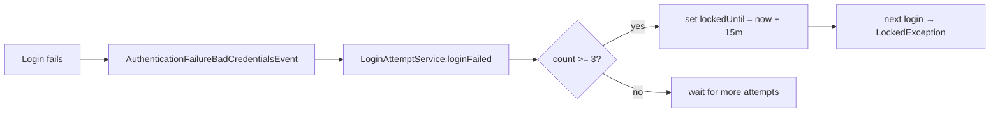

# Attack & Defense Deep Dive

Each section explains the attack, how it manifests against a Spring Boot API, the Spring defense, and the
tests that prove both the flaw and the fix. All demos are self-contained (MockMvc, no network).

← Back to the [README](../README.md)

---

## 1. Broken Access Control / IDOR — `A01:2021`, `CWE-639`

**Attack.** Access control must stop users acting outside their permissions. IDOR (Insecure Direct Object
Reference) is the classic case: the app uses a client-supplied id (`/api/accounts/{id}`) to fetch an
object but never checks the caller *owns* it — so changing `1` → `2` reads someone else's data. Vertical
escalation is the sibling case: a regular user reaching an admin-only function.

**In Spring Boot.** A controller that calls `repository.findById(id)` and returns it while the URL rule
only requires `.authenticated()`.

**Defense.**
- Deny-by-default URL rules for function-level access: `.requestMatchers("/api/admin/**").hasRole("ADMIN")`.
- **Object-level** ownership with method security — the real IDOR fix:
  ```java
  @PostAuthorize("returnObject.owner == authentication.name or hasRole('ADMIN')")
  public Account getAccount(Long id) { ... }
  ```
  Or scope the query to the principal: `repository.findByIdAndOwner(id, principal)`.

**Tests.** `AccessControlVulnerabilityTest` (bob reads alice's object → 200 on the unguarded controller);
`AccessControlDefenseTest` (owner → 200, other user → 403, admin → 200, anonymous admin path → 401).

---

## 2. CSRF — `A01:2021`, `CWE-352`

**Attack.** A malicious page makes the victim's browser send a state-changing request to a site where the
victim is logged in; cookies are attached automatically, so the server cannot tell forged from genuine.

**In Spring Boot.** Any cookie/session `POST` with `csrf(csrf -> csrf.disable())` — the most copy-pasted
misconfiguration in tutorials. Nuance: a purely stateless bearer-token API genuinely does *not* need CSRF
(the browser never auto-sends `Authorization`), so disabling it there is correct.

**Defense.** CSRF protection is **on by default** (synchronizer token, validated on unsafe methods; in
Spring Security 6 the token is XOR-randomised per request for BREACH protection). Keep it for the web
chain; disable it only for the stateless API.

**Tests.** `CsrfVulnerabilityTest` (tokenless POST accepted when protection is absent);
`CsrfDefenseTest` (tokenless → 403, valid token → processed, tampered token → 403, stateless API exempt).

---

## 3. Session Fixation — `A07:2021`, `CWE-384`

**Attack.** The attacker plants a known session id on the victim (e.g. `;jsessionid=`), the victim logs
in, and if the app keeps the pre-login id the attacker now holds an authenticated session.

**Defense.** Automatic in Spring Security. The default `changeSessionId` strategy rotates the session id
at authentication; `none` disables it (vulnerable — used only in the demo). Concurrency control
(`maximumSessions(1)`) is a useful companion.

**Tests.** `SessionFixationVulnerabilityTest` contrasts `NullAuthenticatedSessionStrategy` (id unchanged)
with `ChangeSessionIdAuthenticationStrategy` (id rotated); `SessionFixationDefenseTest` logs in through
the real app and asserts the pre-login id is replaced.

---

## 4. Brute Force / Credential Stuffing — `A07:2021`, `CWE-307`

**Attack.** Brute force guesses many passwords for one account; credential stuffing replays
username/password pairs leaked elsewhere. Both exploit logins with no throttling.

**Defense.** Spring Security ships **no built-in lockout**, so this repo builds one on its authentication
events: `AuthenticationEventListener` counts `AuthenticationFailureBadCredentialsEvent`s in
`LoginAttemptService`, and after the threshold sets the user's `lockedUntil`. `JpaUserDetailsService` then
reports the account locked, and `DaoAuthenticationProvider` rejects it *before* checking the password. A
`Clock` is injected so lockout expiry is testable without `Thread.sleep`.



**Tests.** `BruteForceVulnerabilityTest` (100 wrong guesses then the correct one still works, with no
throttle); `BruteForceDefenseTest` (3 failures lock the account so even the correct password is rejected);
`LoginAttemptServiceTest` (locks at threshold, unlocks after the window using a mutable clock).

---

## 5. Weak Password Storage — `A02:2021`, `CWE-256 / CWE-916`

**Attack.** Plaintext or fast unsalted hashes mean one DB leak burns every credential; identical hashes
also reveal password reuse.

**Defense.** BCrypt via `DelegatingPasswordEncoder`: salted (two encodings of the same password differ),
adaptive (tunable work factor), and prefixed (`{bcrypt}`) so schemes can be migrated. Spring's
`DaoAuthenticationProvider` also runs the encoder against a dummy value for unknown users, mitigating
username-enumeration timing.

**Tests.** `PasswordStorageTest` (plaintext is readable and reveals reuse; BCrypt is prefixed,
non-reversible, verifiable, and uniquely salted).

---

## 6. JWT Attacks — `A02/A07:2021`, `CWE-345 / CWE-347`

**Attacks.**
- **`alg=none`** — a token whose header declares no signature; a naive parser trusts forged claims.
- **Weak HMAC secret** — HS256 with a low-entropy key recovered by an offline dictionary attack.
- **Wrong / missing signature verification** — decoding the payload without verifying the signature.
- **Expired-token acceptance** — never checking `exp`.

**Defense.** The OAuth2 Resource Server (`oauth2ResourceServer(o -> o.jwt(...))`) with `NimbusJwtDecoder`
verifies the signature against the configured key, allow-lists the algorithm (so `none` is never
accepted), and enforces `exp`/`nbf` via `JwtTimestampValidator`. Nimbus also requires HMAC keys ≥ 256
bits, structurally ruling out tiny secrets.

**Tests.** `JwtVulnerabilityTest` (a naive parser trusts an `alg=none` forgery; a weak secret is
recovered by dictionary); `JwtDefenseTest` (valid token → 200; `alg=none`, wrong key, and expired tokens
→ 401).

---

## 7. XSS + Missing Security Headers — `A03:2021`, `CWE-79`

**Attack.** Attacker-controlled input echoed into HTML without encoding executes as script (reflected or
stored). Missing headers remove defense-in-depth.

**Defense.** Context-appropriate **output encoding** is primary (`HtmlUtils.htmlEscape`, template
auto-escaping, correct `application/json` content type). Add **CSP** and keep the default `nosniff` /
`X-Frame-Options` headers as defense-in-depth.

**Tests.** `HeadersXssVulnerabilityTest` (raw `<script>` reflected, no security headers on an unprotected
response); `HeadersXssDefenseTest` (input HTML-escaped; `X-Content-Type-Options`, `X-Frame-Options`, and
`Content-Security-Policy` present).

---

← Back to the [README](../README.md) · see also [best-practices.md](best-practices.md)
